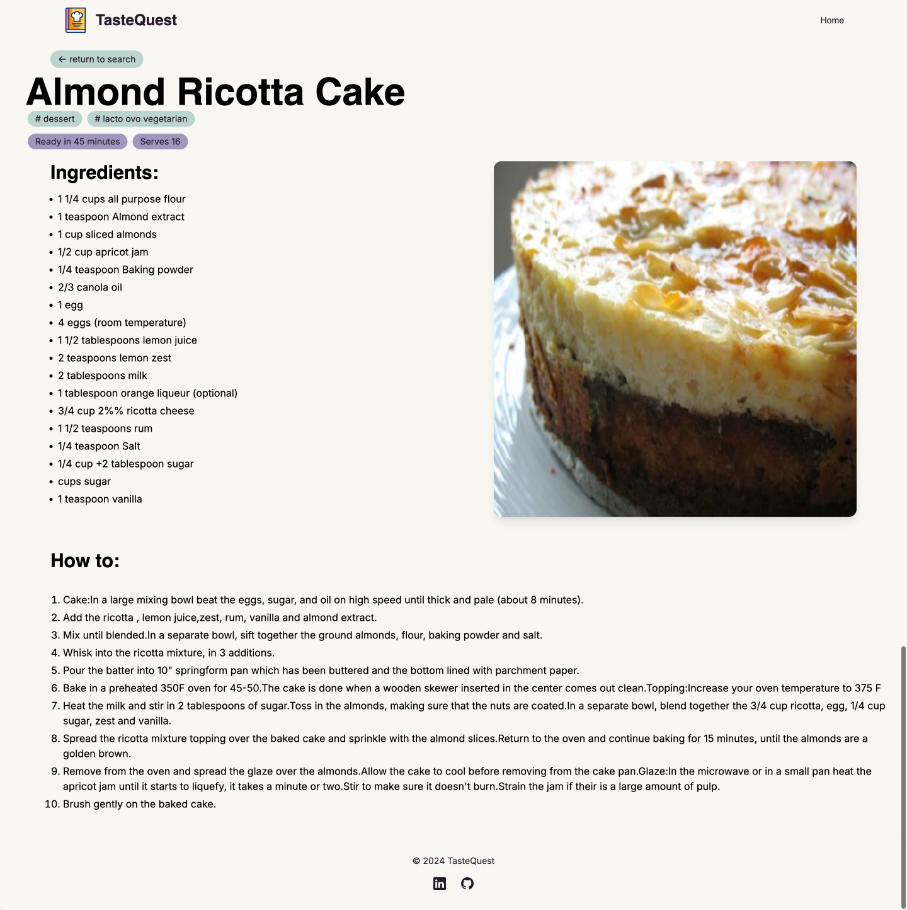

# Taste Quest

Taste Quest - Your Personal Recipe Search Platform

## Table of Contents

- [Full Description](#full-description)
- [Features](#features)
- [How to Use](#how-to-use)
- [List of Dependencies](#list-of-dependencies)
- [Technologies Used](#technologies-used)
- [API Documentation](#api-documentation)
- [Screenshots](#screenshots)
- [License](#license)


## Full Description

Taste Quest is a user-friendly website designed to help food enthusiasts find recipes quickly based on recipe names. Powered by the Spoonacular API, Taste Quest allows users to search for recipes, apply filters like category, cuisine, diet, and intolerances, and view a full recipe in a clean, intuitive layout. The application is optimized for all devices, ensuring users can search for their favourite recipes on any device at any time.

**User Story:**  
As a user, I want to search for recipes by name, view a list of relevant results, and easily access full recipe instructions on a dedicated page, so I can cook dishes conveniently and efficiently.

**URL of the deployed app:**  
[Taste Quest - Deployed URL](https://taste-quest.netlify.app/)

## Features

- **Recipe Search by Name:** Users can search for recipes using specific recipe names.
- **Filter Options:** Users can filter search results by category, cuisine, diet, and intolerances.
- **Responsive and Accessible UI:** The application is responsive and ensures a seamless experience across all devices while adhering to accessibility standards.
- **Clean Recipe Overview:** Each recipe opens on a dedicated page with step-by-step instructions, ingredients, and other essential details.

## How to Use

1. Visit the deployed application: [Taste Quest - Deployed URL](https://taste-quest.netlify.app/)
2. Enter a recipe name in the search bar on the main page.
3. Apply filters as needed (category, cuisine, diet, intolerances).
4. Browse through the search results and select a recipe.
5. View the full recipe details on a separate page, including ingredients and preparation instructions.

## List of Dependencies

- **Next.js:** A React framework used for server-side rendering and static site generation.
- **TypeScript:** A typed superset of JavaScript that adds static types for better development experience and code reliability.
- **Tailwind CSS:** A utility-first CSS framework used for styling and responsive design.
- **Flowbite CSS:** A component-based CSS library that complements Tailwind CSS with prebuilt UI components.
- **Spoonacular API:** A recipe search API that allows us to fetch recipes by name and retrieve detailed recipe data.
- **Netlify:** The platform used to deploy and host the application.

## Technologies Used

- **HTML5 & CSS3:** The standard technologies used for structuring and styling the application's user interface.
- **Git & GitHub:** Version control system and repository hosting service used for code management and collaboration.
- **npm (Node Package Manager):** A package manager for installing and managing project dependencies and packages.
- **Tailwind CSS & Flowbite:** Utility-first CSS frameworks that streamline UI development and provide ready-made components for a consistent design.
- **Next.js:** Server-side rendering and static site generation framework, enhancing performance and SEO.
- **TypeScript:** Enhances the robustness of the code by adding static typing and developer tools.
- **Netlify:** Deployment platform for the application, ensuring smooth and optimized delivery of the app.
- **Figma:** Used for wireframing and designing the user interface.

## API Documentation

### Spoonacular API

- **Endpoint:** [Spoonacular Recipe API](https://rapidapi.com/spoonacular/api/recipe-food-nutrition/playground/57d3f037e4b0bf08d74df7f5)
- **Description:** Spoonacular API provides a wide array of recipes and nutritional information, allowing users to search for recipes based on various criteria.
- **Authentication:** API key authentication is required to access Spoonacular API endpoints. Obtain an API key by signing up on the Spoonacular platform.
- **Usage:** Make HTTP requests to the appropriate endpoints with search queries and filters to fetch recipe data.
- **Documentation:** For detailed API documentation, usage guidelines, and examples, refer to the official Spoonacular API documentation available on the [RapidAPI Spoonacular page](https://rapidapi.com/spoonacular/api/recipe-food-nutrition/playground/57d3f037e4b0bf08d74df7f5).

## Screenshots

  
*Screenshot of the main search page where users can search for recipes.*

  
*Screenshot of a recipe details page that shows ingredients and preparation instructions.*

## License

This project is licensed under the MIT license.

```
MIT License
-----------

Permission is hereby granted, free of charge, to any person obtaining a copy
of this software and associated documentation files (the "Software"), to deal
in the Software without restriction, including without limitation the rights
to use, copy, modify, merge, publish, distribute, sublicense, and/or sell
copies of the Software, and to permit persons to whom the Software is
furnished to do so, subject to the following conditions:
...

```

---
